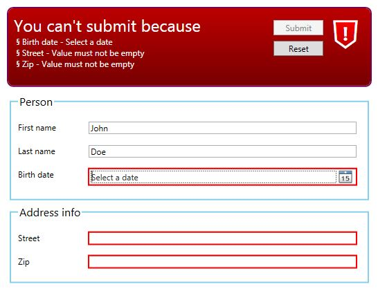

FSharp.Client.Formlet
=====================

The major inspiration for this library comes from WebSharper (https://github.com/intellifactory/websharper).

WebSharper demonstrated how powerful a, so called, Formlet can be to represent an interactive form.

WebSharper impressed so much that we think Formlets are the current best way to represent interactive forms in F#.

Formlets are awesome because:
* They are functionally idiomatic, that means they feel right in a functional language such as F#
* They are endlessly composable. That means any formlet can be combined with any other formlet to produce a new formlet.
* Using formlets it's trivial to create highly interactive forms.

Example
-------

```fsharp
// Defines how to input personal information
let person =
    formlet {
        let! firstName  = LabeledText       "First name"    "John"
        let! lastName   = LabeledText       "Last name"     "Doe"
        let! birthDate  = LabeledDateTime   "Birth date"    None
        return firstName, lastName, birthDate
    }
    |> Enhance.WithLegend "Person"

// Defines how to address information
let address =
    formlet {
        let! street = LabeledText       "Street"    ""
        let! zip    = LabeledText       "Zip"       ""
        return street, zip
    }
    |> Enhance.WithLegend "Address info"

// Combines the personal and address info formlets and adds an error summary
//  Two formlets combined results in a new formlet which in turn can be combined
//  And so on...
let f =
    formlet {
        let! firstName, lastName, birthDate = person
        let! address                        = address
        return firstName, lastName, address,
    }
    |> Enhance.WithErrorSummary

```

This defines a form like below:



While this is rather static what's really great with Formlets is the ease
how you can build Forms that react to different input. The simplest way would
be an if expression

```fsharp
let f =
    formlet {
        let! country    = LabeledText "Country" "SWEDEN"
        let! orgNo      = LabeledText "Org no"  ""
        let! mva        =
            // In Norway a company needs to have an MVA number in addition to the OrgNo
            if country = "NORWAY" then
                LabeledText "MVA" ""
            else
                FormletMonad.Return "N/A"

        return country, orgNo, mva
    }
```

If country is "NORWAY" the MVA input textbox is shown, otherwise not.

A slightly more interesting example involves the Option input:

```fsharp
let empty =
    formlet {
        return "", None
    }

let sweden =
    formlet {
        let! orgNo = LabeledText "Org no" ""
        return orgNo, None
    }

let norway =
    formlet {
        let! orgNo  = LabeledText "Org no" ""
        let! mva    = LabeledText "MVA" ""
        return orgNo, Some mva
    }

let companyInfo =
    let options = LabeledOption "Country" empty [|"Sweden", sweden; "Norway", norway|]
    formlet {
        let! name       = LabeledText   "Name"      ""
        // The user selects an option that evaluates into a formlet
        let! country    = options
        // This invokes the selected formlet presenting the user a different
        // form depending on the selected option
        // This is just mind-boggling cool and succinct
        let! orgNo, mva = country
        return name, orgNo, mva
    }
    |> Enhance.WithLegend "Company info"
```


Extensibility
-------------

It's very important to have an extensibility story and FSharp.Client.Formlet is designed to not be locked into to a special platform.

Obviously the various adaptations are tied to a platform but the core is agnostic.

In addition, it shall be possible for a user of FSharp.Client.Formlet to extend with custom formlets that combines like the other formlets.

It's preferable if creating a formlet isn't overly hard.

Example of the basic text input formlet
---------------------------------------

```fsharp
/// The visual element of the text input formlet
type InputTextElement(initialText : string) as this =
    inherit TextBox()

    let mutable text                = initialText

    do
        this.Text   <- initialText
        this.Margin <- DefaultMargin

    member val ChangeNotifier = EmptyChangeNotification with get, set

    override this.OnLostFocus(e) =
        base.OnLostFocus(e)

        if text <> this.Text then
            text <- this.Text

            this.ChangeNotifier ()

/// The text input Formlet
let Text initialText : Formlet<FormletContext, UIElement, string> =
    let eval (fc,cl,ft : FormletTree<UIElement>) =
        let e =
            match ft with
            | Element (:? InputTextElement as e)-> e
            | _                                 ->
                InputTextElement(initialText)
        e.ChangeNotifier <- cl
        (FormletResult.Success e.Text), Element (e :> UIElement)

    FormletMonad.New eval

```